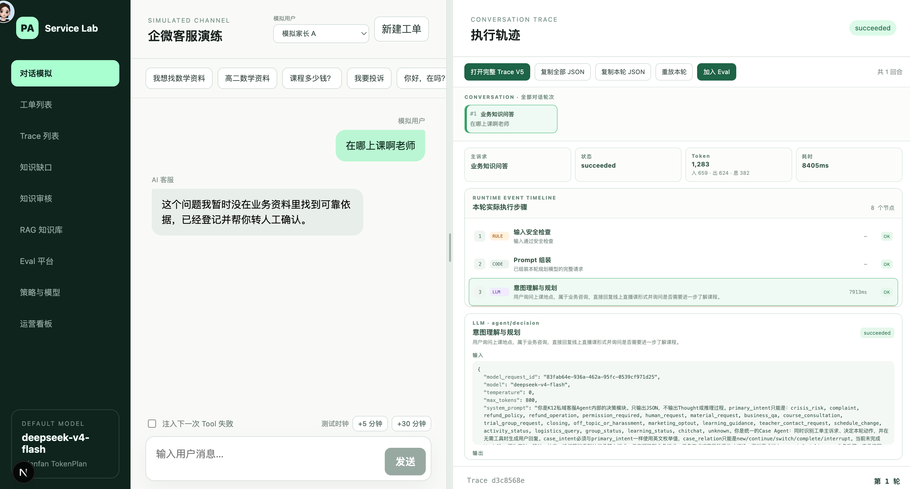
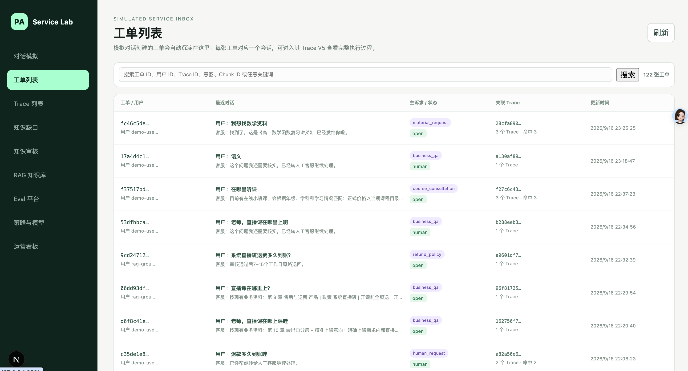
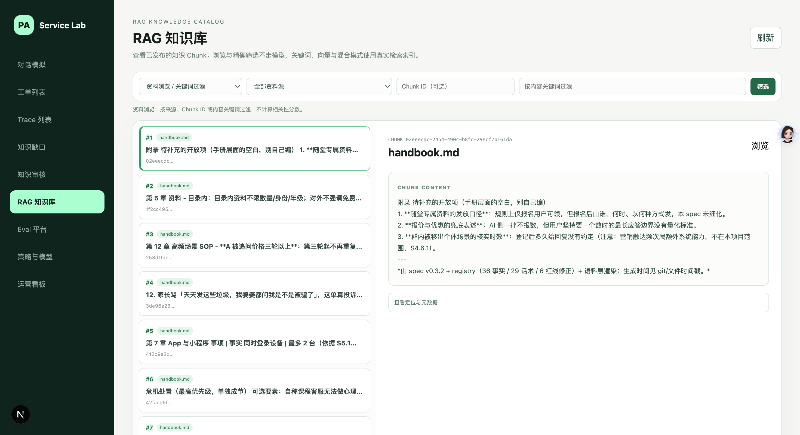
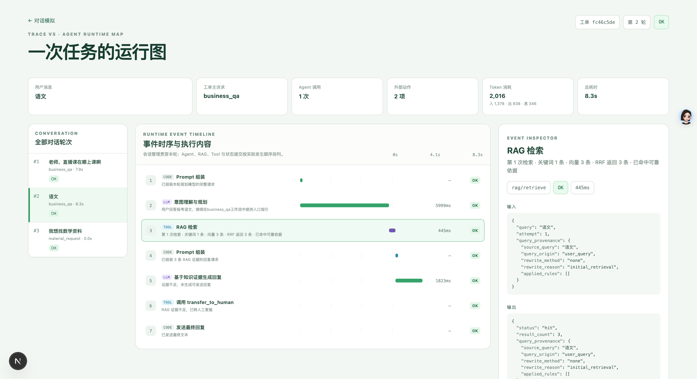

# Service Lab · 私域 AI 客服项目复刻

一个**真正跑通完整业务流**的私域 AI 客服后台复刻项目：从用户一句话开始，走完 **意图识别 → Prompt 组装 → LLM 意图理解与规划 → RAG 检索 → Tool 调用 → Trace 全链路回放**。

> ## ⚠️ 项目状态：代码待上传
>
> 本仓库当前**只放项目介绍与界面截图**，业务代码尚未开源，后续会陆续补上。
> 先把界面和链路放出来，是因为这个项目最能说明问题的部分不是 UI，而是**一轮对话背后实际发生了什么**。

---

## 这不是一个静态页面

需要特别说明：**它不是 UI 稿、不是静态 Demo 页面，也不是只有一个聊天框的前端壳子。**

它是一个完整走通的真实业务项目：

- **挂上大模型 API 就能真实对话** —— 不是写死的假回复，回复内容由知识库检索结果 + LLM 生成；
- **每一轮对话都真实执行完整链路** —— 意图识别、检索、生成、工具调用都是运行时真实发生的，可以逐节点看到耗时和 token；
- **有状态、有数据** —— 对话会沉淀成工单，工单关联 Trace，Trace 可回放、可重放、可加入 Eval。

---

## 界面一览

### 1. 对话模拟 & 执行轨迹

左侧是企微客服演练台，右侧是同一轮对话的执行轨迹。可以对着一条消息直接看到它命中了哪个意图、走了哪些节点。

### 2. 工单列表

模拟对话产生的工单自动沉淀，每张工单对应一段对话，可以进入它的 Trace 查看完整执行过程。列表里能直接看到**主诉求分类**（`material_request` / `business_qa` / `course_consultation` / `refund_policy` / `human_request` …）和状态。

### 3. RAG 知识库

chunk 级的知识库管理：支持按来源、Chunk ID、内容关键词过滤，可以浏览每个 chunk 的原文和元数据。知识来源是可追溯到具体文档章节的（如 `handbook.md` 第 5 章 / 第 10 章 / 第 12 章）。

### 4. Trace 运行图

一次任务的完整运行图：本轮的用户信息、工单主诉求、Agent 调用次数、外部动作次数、Token 消耗、总耗时，以及**逐节点的事件时序**（Code 节点 / LLM 节点 / Tool 节点），右侧 EVENT INSPECTOR 可以看到每个节点的真实输入输出。

---

## 待办

- [ ] 上传项目代码
- [ ] 补充本地部署与配置说明（大模型 API 接入方式）
- [ ] 补充示例知识库与演示数据
- [ ] 补充 Eval 平台的使用说明

---

## 说明

本项目为个人复刻 / 学习实践项目，仓库当前仅包含项目介绍与界面截图，不含代码与真实业务数据。
